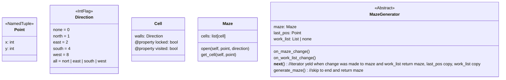

```mermaid
classDiagram
	class Point{
		<<NamedTuple>>
		x: int
		y: int
	}

	class Direction{
		<<IntFlag>>
		none = 0
		north = 1
		east = 2
		south = 4
		west = 8
		all = nort | east | south | west
	}
	class Cell{
		walls: Direction
		@property locked: bool
		@property visited: bool
	}
	class Maze{
		cells: list[cell]
		open(self, point, direction)
		get_cell(self, point)
	}
	class MazeGenerator{
		<<Abstract>>
		maze: Maze
		last_pos: Point
		work_list: List | none
		on_maze_change()
		on_work_list_change()
		__next__() //iterator yeld when change was made to maze and work_list return maze, last_pos copy, work_list copy
		generate_maze() //skip to end and return maze
	}
```